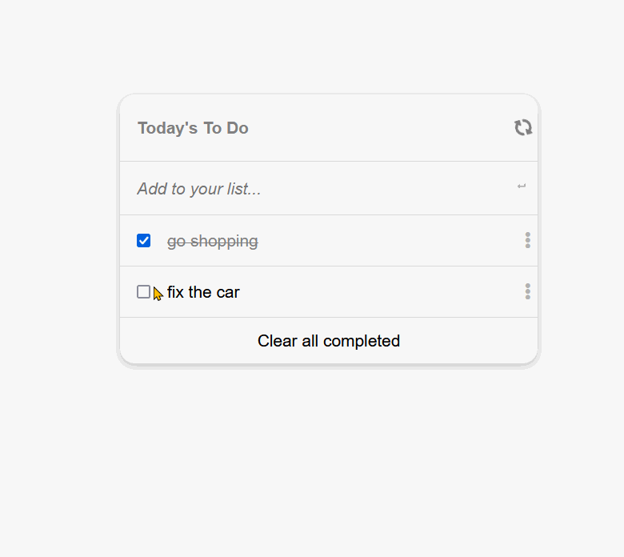

# Todo Project

> A simple HTML todo project

[Live Demo](https://mrbrn197.github.io/Todo-Project/dist/)

## Built With

- CSS, HTML, JS
- Webhint, Hint, Stylelint
- Webpack

## Getting Started

To get a local copy up and running clone the repo and run

`npm install`

### Install

to build a the project into `./dist` folder run

`npm run build`

### Usage

to start the webpack-dev-server run

`npm run serve`

## Authors

👤 **Brian Orora**

- GitHub: [@MrBrN197](https://github.com/githubhandle)
- LinkedIn: [brianorora](https://www.linkedin.com/in/brian-orora-2b7883a7/)

## 🤝 Contributing

Contributions, issues, and feature requests are welcome!

Feel free to check the [issues page](../../issues/).

## Show your support

Give a ⭐️ if you like this project!

## Acknowledgments

- Hat tip to anyone whose code was used
- Inspiration
- etc

## 📝 License

This project is [MIT](./MIT.md) licensed.
